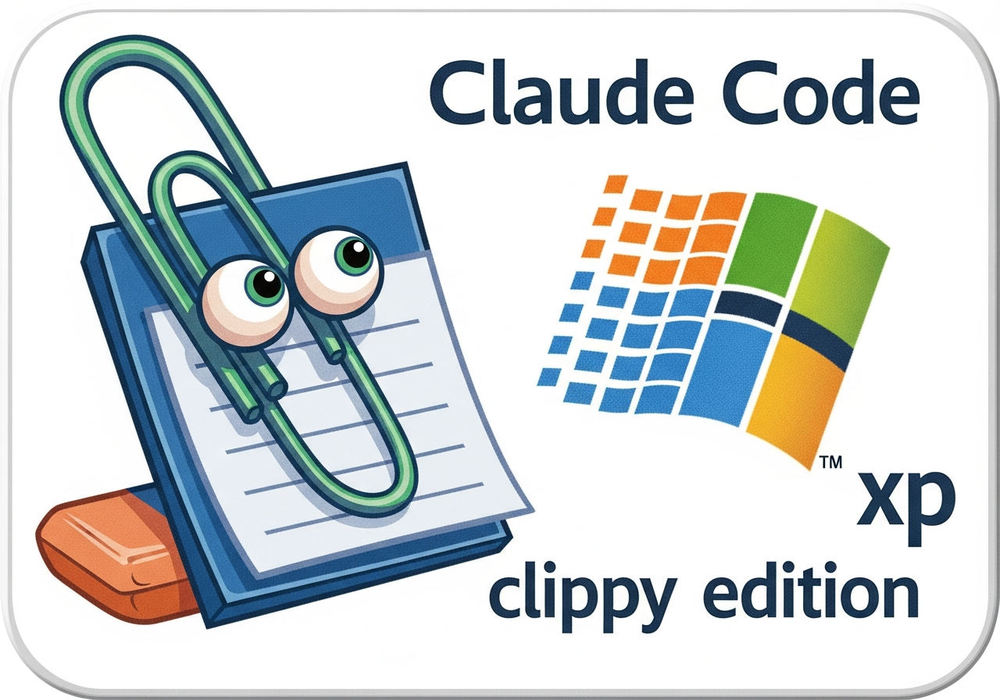

<p align="center">
  
</p>

# xpharness

A tiny agentic coding harness — a stripped-down Claude Code — that runs in
**PowerShell 2 on Windows XP**. It gives the model a set of tools (run/read/
write/edit files, grep/find, **native C compilation**, web search, ASCII-art,
and more — see below) and loops tool calls until it produces a final answer,
just like a modern agent harness. It can also run small models fully offline.

> Hobby / educational project. No warranty. It talks to a paid API (your key,
> your spend) and ships an end-of-life TLS stack (OpenSSL 1.0.2) for the XP
> transport — don't push anything sensitive through it.

## Quickstart

On a **modern** Linux/mac box (XP can't fetch these over TLS) with `curl`,
`python3`, and `gcc-mingw-w64-i686`:

```sh
git clone https://github.com/<you>/xpharness && cd xpharness
./setup.sh                       # fetch curl/TCC/models, build the XP engines
cp config.sample.ps1 config.ps1  # then paste your Anthropic API key into it
```

Copy the folder to the Windows XP box (SFTP/USB). On XP, once (see
*Prerequisites*): install **.NET 3.5** and the **VC++ 2005 redistributable**,
then:

```bat
powershell -ExecutionPolicy Bypass -File test-curl.ps1 sk-ant-...   :: prove TLS 1.2 works
powershell -ExecutionPolicy Bypass -File harness.ps1                :: launch
```

…or just **double-click `xpharness.bat`** (it sets the working directory and
launches the harness for you). Want the Clippy icon on it? Make a desktop
shortcut to `xpharness.bat`, then Properties → Change Icon → browse to
`images\clippy-xp.ico`.

### Demo

Launch greets you with a banner and a familiar paperclip:

```
 ### #    ### ###  ###  #  #      #  # ###
#    #     #  #  # #  #  ##        ##  #  #
#    #     #  ###  ###    #  ####   #  ###
#    #     #  #    #      #        ##  #
 ### #### ### #    #      #       #  # #
 __
/  \
|  |
@  @
|| ||
|| ||
|\_/|
\___/

It looks like you're coding on Windows XP. Want some help?
ready. Model: claude-sonnet-4-6
```

Then it's an agent loop with real tools — here it writes, compiles, and runs C
natively on XP via the bundled Tiny C Compiler:

```
[C:\dev]
you: make a folder fib, write a C program that prints the first 15 Fibonacci
     numbers, compile it and run it

  -> make_dir      MKDIR fib                       allow? [y/N]: y
  -> write_file    WRITE 249 chars to: fib\fib.c   allow? [y/N]: y
  -> compile_run   COMPILE & RUN C (249 chars)     allow? [y/N]: y

  compiled OK, exit 0
  0 1 1 2 3 5 8 13 21 34 55 89 144 233 377
  [tokens] call: in 3459 out 185 | session: in 15491 out 666
```

Other things to try: `/models local-tl` (chat with a 1.1B model fully offline),
`banner "HELLO"`, `image_to_ascii` on a `.bmp`, `/paste` to send your clipboard.

## The TLS problem (and why this works)

Windows XP's TLS lives in the OS crypto library (**SChannel**), which tops out at
**TLS 1.0**. The Anthropic API requires **TLS 1.2**. PowerShell's `WebClient` /
`Invoke-WebRequest` go through SChannel, so they **cannot** connect — no setting
fixes this, because the OS literally can't speak TLS 1.2.

The fix is the same trick the Supermium browser uses on XP: **bring your own
crypto.** We shell out to a curl build that bundles its own OpenSSL instead of
using SChannel. That curl can negotiate TLS 1.2 on an OS from 2001.

## Prerequisites

1. **.NET Framework 3.5** on the XP box — needed for JSON
   (`System.Web.Extensions` / `JavaScriptSerializer`). PowerShell 2 has no
   `ConvertTo-Json`.
2. **Microsoft Visual C++ 2005 Redistributable** — `bin\curl.exe` links against
   `msvcr80.dll`, which is NOT on a stock XP install. Without it curl won't even
   start ("application failed to initialize" / missing DLL). Install the VC++ 2005
   redist (vcredist_x86.exe) on the XP box. This is the one non-obvious gotcha.
3. **The binaries/models are not committed** (size + licensing). Run `setup.sh`
   on a modern machine to fetch and build them — see *Building from a clone*.
   - curl: 7.42.1 + OpenSSL 1.0.2u (static, TLS 1.2) from
     [`OmegaAOL/curl-windows98`](https://github.com/OmegaAOL/curl-windows98).
   - `cacert.pem`: Mozilla CA bundle from <https://curl.se/ca/cacert.pem>.

## Building from a clone

The repo holds source only. On a **modern Linux/mac** box (XP can't reach these
hosts over TLS), with `curl`, `python3`, and the 32-bit MinGW cross-compiler
(`sudo apt install gcc-mingw-w64-i686`):

```
./setup.sh              # curl, TCC, TinyStories models, build engines
./setup.sh --tinyllama  # also export TinyLlama-1.1B int8 (needs torch; ~2.2GB)
```

Then `copy config.sample.ps1 config.ps1`, add your API key, and SFTP the whole
folder to the XP box. Licenses for the fetched components: see
[`THIRD-PARTY-NOTICES.md`](THIRD-PARTY-NOTICES.md).

### Burn it to a DVD (optional)

```
./make-iso.sh    # -> xpharness.iso (full bundle is ~1.6GB, needs a DVD)
```

The ISO ships an `autorun.inf` so the disc shows the Clippy icon and
double-clicking the drive launches the harness. Your `config.ps1` is **not**
included — on the XP box, put it at `%USERPROFILE%\xpharness\config.ps1` (the
harness looks there when running from read-only media). Burn the `.iso` as a
disc image (ImgBurn on XP, or "Burn disc image" on Win7+), not as a file copy.
The big `local-tl` model is slow off optical media — copy `llm\` to the HDD if
you want to use it.

## Setup

```
xpharness\
  harness.ps1
  xpharness.bat       (double-click launcher)
  extras.ps1          (retro flair: banner + image_to_ascii)
  test-curl.ps1       (step-1 TLS check)
  config.sample.ps1
  config.ps1          (you create this)
  bin\
    curl.exe          (bundled)
    cacert.pem        (bundled)
  tools\
    tcc\              (bundled Tiny C Compiler - enables compile_run)
  llm\                (optional offline models - see llm\README.md)
```

SFTP the whole folder to the XP box, then:

1. Install the VC++ 2005 redist (see prerequisites) so `curl.exe` can run.
2. **Step 1 — prove TLS works** (do this first):
   ```
   powershell -ExecutionPolicy Bypass -File test-curl.ps1 YOUR_API_KEY
   ```
   You want to see `"tls_version":"TLS 1.2"` from the howsmyssl check and a JSON
   model list from Anthropic. If so, the hard part (TLS on XP) is solved.
3. **Step 2 — run the harness**: copy `config.sample.ps1` → `config.ps1`, paste
   your `ApiKey`, then:
   ```
   powershell -ExecutionPolicy Bypass -File harness.ps1
   ```

## Slash commands (typed at the `you:` prompt)

| Command | Does |
|---|---|
| `/help` | list commands |
| `/paste` | submit clipboard contents as the prompt (good for multi-line) |
| `/multi` | enter multi-line input manually (end with a line of just `.`) |
| `/models [name]` | switch: `sonnet`/`haiku`/`opus` (API), or `local`/`local-110m`/`local-tl` (offline) |
| `/cwd` | show the current working directory |
| `/cd <path>` | change the working directory |
| `/tokens` | session token + cost totals |
| `/tools` | list available tools |
| `/reset` | clear the conversation (keeps the session running) |
| `/save [file]` | save a resumable session as JSON (default `xph_session.json`) |
| `/load [file]` | restore a saved session and keep going (default `xph_session.json`) |
| `/export [file]` | save a readable transcript (default `xph_transcript.txt`) |
| `exit` / `quit` | leave |

## Tools the model can call

- `run_command` — run a cmd.exe command (with timeout, see below)
- `read_file` — read a text file; supports `offset`/`limit` line windows and
  `line_numbers` for big files
- `write_file` — create / overwrite a file (keeps a `.bak`, shows a diff preview)
- `edit_file` — surgical search-and-replace (`old_text`→`new_text`, unique unless
  `replace_all`; diff preview + `.bak`). Preferred over `write_file` for changes.
- `undo_file` — restore a file from its `.bak`
- `grep` — search file contents for a pattern (`recurse` for trees)
- `find` — find files by name pattern (e.g. `*.ps1`)
- `list_dir` — list a directory
- `set_cwd` — change the working directory for all later tools (persists)
- `make_dir` — create a directory (and any missing parents)
- `compile_run` — **compile and run C natively** via the bundled Tiny C Compiler
- `detect_toolchains` — report available compilers/interpreters (tcc, gcc, cl, python, ...)
- `banner` — big ASCII-art text (offline, built-in font)
- `image_to_ascii` — render an image file as ASCII art (offline, pure PS2 + GDI+)
- `web_search` — **Exa** web search over `curl.exe` (TLS 1.2). Set `ExaApiKey`
  in config to enable it; without a key the tool returns a "not configured"
  message and the model falls back to its own knowledge. Great for current docs
  and APIs the (old) model context may not have.

## Known limitations / edge cases

- **Streaming** — on by default (`Stream`), the answer prints as it arrives.
  It's read from curl's raw stdout decoded as UTF-8 directly (XP can't set a
  UTF-8 console codepage), so non-ASCII stays correct. Set `Stream=$false` for
  the simpler file-based request.
- **Markdown rendering** — `RenderMarkdown` approximates bold/italic/headings/
  lists with the 16 console colors (no true bold/italic exists in the XP
  console). Set `$false` for plain teal text.
- **Command timeout** — `run_command` kills anything exceeding
  `CommandTimeoutSec` (default 30s) and returns partial output, so a hung or
  interactive program won't freeze the loop. Bump it in config for slow builds.
- **Token/cost readout** — each turn prints input/output tokens and a session
  running total (the agent loop makes several API calls per turn, all counted).
  Set `PriceInPerMTok` / `PriceOutPerMTok` in config to also show a ~$ estimate.
- **Encoding** — files are written UTF-8 no-BOM. Old XP tools may expect the
  system codepage; adjust `$Utf8` in `harness.ps1` if you see mojibake.
- **JSON size** — capped at 64 MB (`MaxJsonLength`). Huge files via `read_file`
  will blow the context anyway; prefer `run_command` with `find`/`type`.
- **Confirmation prompts** — `Confirm = $true` in config asks before every
  command/write. Set `$false` to let it run unattended (riskier).
- **.NET 3.5 missing?** If `LoadWithPartialName` fails, the harness can't do JSON.
  Either install .NET 3.5 or replace the JSON helpers with a hand-rolled parser.

## How it works

```
REPL (you type)
   -> add user message
   -> Send-ToClaude: serialize convo to JSON, POST via curl over TLS 1.2
   -> parse response
        - print text blocks
        - if stop_reason == "tool_use": run each tool, append tool_result, loop
        - else: done, back to prompt
```

All state is the `$messages` array — the full conversation is resent each turn,
which is exactly how the real thing works under the hood.

Startup shows a `CLIPPY-XP` ASCII banner and a paperclip in `BannerColor`
(config; default `Green` — the XP console only has 16 colors, so avoid `Blue`
and `DarkYellow`, which look bad). Type `/paste` to send your clipboard, `/multi`
for manual multi-line input.

## Licensing

The original harness code is **MIT** ([`LICENSE`](LICENSE)). `setup.sh` downloads
third-party components (curl/OpenSSL, Tiny C Compiler, llama2.c, TinyStories,
TinyLlama, the Llama-2 tokenizer) from their upstream sources under their own
licenses — they are **not** redistributed here. See
[`THIRD-PARTY-NOTICES.md`](THIRD-PARTY-NOTICES.md). Notably TCC is LGPL and the
tokenizer is under Meta's Llama 2 license; the download-on-setup approach keeps
you from being their redistributor.

`config.ps1` (your API keys) is git-ignored — commit only `config.sample.ps1`.
